Product Requirements Document (PRD)

PinCatcher

Codename: PinCatcher
Tagline: Catch pinned traffic. No root required.
Versi: 1.0 (Beta Ready)
Status: Production Ready
Platform: Android Native
Lisensi: Open Source (Apache-2.0)
Distribusi: GitHub Releases + F-Droid
Target Utama: Android 13 (API 33)
Pengembangan: Mobile-first workflow, on-device

---

Daftar Isi

1. Overview
2. Requirements
3. Core Features
4. User Flow
5. Architecture
6. Database Schema
7. Tech Stack
8. Appendix

---

1. Overview

1.1 Latar Belakang

Reqable, Charles, dan Fiddler adalah standar industri untuk debugging HTTP/HTTPS. Namun semua tools tersebut memiliki keterbatasan untuk use-case spesifik: capture traffic dari APK target yang memiliki SSL Pinning aktif, di device non-root.

Kondisi saat ini:

· Reqable/Charles: Gagal capture APK dengan SSL Pinning tanpa root
· Frida + Objection: Butuh root atau setup ADB + Python yang ribet
· apk-mitm: CLI-only, butuh Node.js
· MITM Proxy manual: Butuh laptop + device + setup panjang

Gap: Tidak ada aplikasi Android yang bisa extract, patch, reinstall, dan capture APK dalam satu app, non-root, dengan storage ringan.

PinCatcher mengisi gap ini.

1.2 Tujuan Produk

Aplikasi Android native non-root yang memungkinkan user untuk:

1. Extract APK dari installed apps (via ApplicationInfo.sourceDir)
2. Analyze APK untuk deteksi SSL pinning mechanism
3. Patch APK untuk strip pinning & trust user CA (termasuk Flutter)
4. Reinstall APK hasil patch
5. Capture traffic HTTP/HTTPS/WebSocket
6. Inspect traffic dengan UI ringan
7. Export ke HAR / cURL

Semua tanpa root, tanpa laptop, tanpa terminal.

1.3 Target User

Persona Deskripsi Kebutuhan Utama
Bug Bounty Hunter Researcher yang cari vulnerability di API mobile Capture APK dengan pinning, cepat
Security Researcher Analis mobile security Triage APK, capture, export HAR
Developer Debug API app pihak ketiga (dengan izin) Setup cepat, UI ringan
Mahasiswa Belajar mobile security UI intuitif, no CLI
Power User Reverse engineer amatir Semua fitur, no root

1.4 Scope

In Scope (v1.0 Beta — Non-Root)

· ✅ Android native app (Kotlin + Compose)
· ✅ Extract APK via sourceDir (Android 13 focus)
· ✅ Split APK merger
· ✅ APK analyzer (pinning, NSC, anti-tamper, Flutter)
· ✅ APK patcher (NSC inject, smali strip, Flutter engine swap)
· ✅ APK resigner (v1 + v2 + v3 + v4)
· ✅ VPN-based capture
· ✅ User CA cert wizard
· ✅ Traffic inspector
· ✅ Request replay
· ✅ Export HAR 1.2 & cURL
· ✅ Storage optimization (dedup, compression, ring buffer)
· ✅ i18n: Indonesian, English, Russian

In Scope (v1.1)

· Breakpoint & rewrite rules
· Mock response
· Session save/load
· HTTP/2 support

In Scope (v2.0 — Root Pack)

· Auto-install system CA
· iptables mode
· Frida integration

Out of Scope

· iOS, Desktop
· Cloud sync
· Play Integrity / SafetyNet bypass
· Server-side anti-tamper bypass
· Shorebird Flutter
· gRPC advanced

1.5 Success Metrics

Metric Target
Install APK size < 200 MB
Storage per sesi (default) < 50 MB
RAM idle < 150 MB
Patching time (APK < 100 MB) < 3 menit
Patching success rate (native Android) ≥ 90%
Patching success rate (Flutter) ≥ 70%
Setup dari buka app → capture pertama < 5 menit
Crash-free rate 99%
UI frame rate (list 1000+ flow) 60 fps

1.6 Prinsip Produk

1. Mobile-first — Semua flow bisa diselesaikan di HP tanpa laptop
2. Open source — Apache-2.0, kode di GitHub, community-driven
3. Local-only — Tidak ada upload data ke server
4. Storage-conscious — Dedup, compression, ring buffer
5. Honest — Tampilkan limitasi, tidak overpromise
6. Legal — Disclaimer jelas, hanya untuk APK dengan izin

1.7 Disclaimer Legal

PinCatcher hanya untuk analisis APK yang Anda miliki izin untuk menganalisis. Menggunakan tool ini untuk mengakses data tanpa izin adalah ilegal. Semua proses berjalan lokal di device Anda — tidak ada data yang dikirim ke server.

---

2. Requirements

2.1 Functional Requirements

ID Requirement Prioritas
FR-01 List installed apps + extract APK via sourceDir P0
FR-02 File picker untuk APK / split APK P0
FR-03 Merge split APK jadi universal APK P0
FR-04 Analyze APK: pinning, NSC, anti-tamper, Flutter P0
FR-05 Patch APK: inject NSC P0
FR-06 Patch APK: strip smali pinning P0
FR-07 Patch Flutter: swap libflutter.so P0
FR-08 Sign APK ulang (v1+v2+v3+v4) P0
FR-09 Uninstall original + install patched P0
FR-10 Generate CA cert + install as user cert P0
FR-11 Capture via VpnService P0
FR-12 Per-app filter P0
FR-13 Traffic inspector P0
FR-14 Body viewer (JSON, XML, HTML, image, hex) P0
FR-15 Export HAR 1.2 P0
FR-16 Export cURL P0
FR-17 Replay request P0
FR-18 Storage: dedup, compression, ring buffer P0
FR-19 i18n (ID/EN/RU) P0
FR-20 Auto-update via GitHub Releases P0
FR-21 Breakpoint P1
FR-22 Rewrite rules P1
FR-23 Session save/load P1
FR-24 Root mode (v2) P2

2.2 Non-Functional Requirements

ID Requirement Target
NFR-01 Install APK size < 200 MB
NFR-02 Storage cap default per sesi 50 MB
NFR-03 RAM idle < 150 MB
NFR-04 Cold start app < 3 detik
NFR-05 UI frame rate 60 fps
NFR-06 Crash-free rate 99%
NFR-07 Capture latency overhead < 100 ms
NFR-08 Support Android 8.0 – 15 (API 26–35)
NFR-09 Primary target Android 13 (API 33)
NFR-10 Semua patching lokal No upload

2.3 Constraints

· Non-root: hanya user CA cert (bukan system)
· Re-signing = signature beda → app dengan signature check bisa gagal
· Flutter patch terbatas pada snapshot hash yang didukung
· Play Integrity tidak bisa di-bypass non-root
· Distribusi via GitHub Releases (Play Store tidak support)

2.4 Assumptions

· User punya device Android 8+ non-root
· User paham konsep proxy & CA cert
· User punya izin analisis APK target
· Device punya storage ≥ 500 MB free untuk temp patching

2.5 Dependencies Eksternal

· pincatcher-reflutter — Fork reFlutter untuk patched Flutter engine
· BouncyCastle — TLS / cert generation
· Ktor CIO — HTTP server
· dexlib2 + smali/baksmali — DEX patching
· apksig — APK signing

---

3. Core Features

Setiap fitur punya Idea (penjelasan rinci) dan Tasks (checklist). Sub-fitur mengikuti struktur sama.

3.1 Feature Map

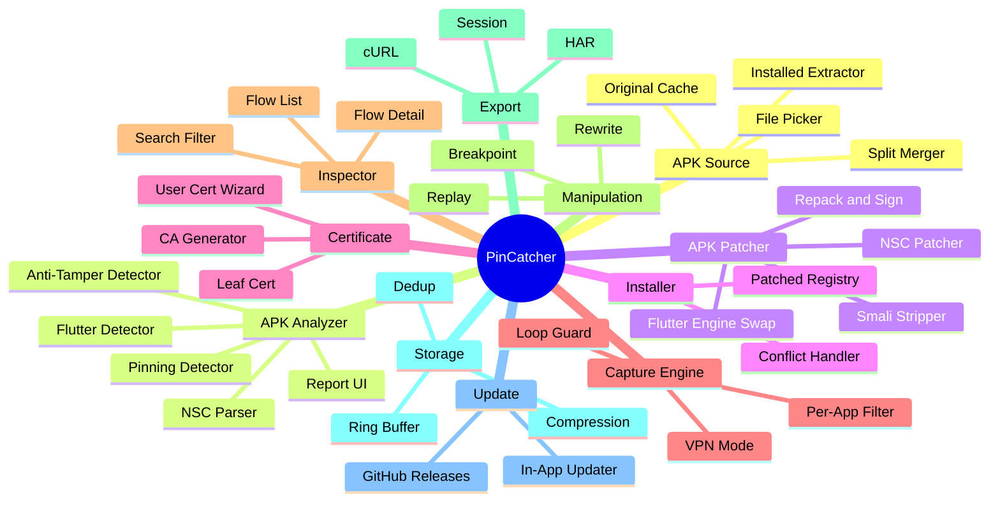

---

Feature 1: APK Source Resolver

Idea:
Modul yang bertanggung jawab mengambil APK target dari device. Strategi:

1. Primary: Baca ApplicationInfo.sourceDir — works non-root di Android 8–15
2. Split handling: Kalau ada splitSourceDirs, extract semua + merge
3. Secondary: File picker untuk APK yang belum diinstall
4. Cache: Simpan APK original untuk restore/upgrade

Kenapa works non-root?

· Path /data/app/~~<random>/<package>-<random>/base.apk — readable oleh app biasa
· Yang diprotect di /data/data/ adalah internal data app, bukan APK
· MT Manager, App Backup, dll membuktikan ini works

Tasks:

☐ PackageManager.getInstalledPackages() untuk list
☐ Extract via sourceDir
☐ Detect split APK
☐ Merge split APK
☐ File picker fallback
☐ Cache original APK
☐ Progress indicator untuk APK besar
☐ Verify copy integrity

Sub-Feature 1.1: Installed APK Extractor

Idea:
Baca ApplicationInfo.sourceDir, copy ke temp storage. Handle: app normal, app di SD card, system app, split APK.

Tasks:

☐ PackageManager.getPackageInfo(pkg, 0)
☐ Ambil applicationInfo.sourceDir
☐ Cek applicationInfo.splitSourceDirs (null = single)
☐ Cek applicationInfo.FLAG_INSTALLED
☐ Copy via FileInputStream + streaming
☐ Progress callback
☐ Verify: size source == size dest
☐ Return: Success(path) / SplitAPK(paths) / Error

Sub-Feature 1.2: Split APK Merger

Idea:
APK modern adalah split APK (base + config). Merge jadi universal APK. Referensi: APKEditor (REAndroid), AntiSplit-M.

Tasks:

☐ Detect: splitSourceDirs != null atau file .apks/.xapk/.apkm
☐ Extract semua split ke temp
☐ Baca AndroidManifest.xml dari base APK
☐ Merge resources, native libs, assets
☐ Patch manifest (hapus isSplitRequired, split attr)
☐ Re-encode AXML
☐ Repack
☐ Cleanup temp

Sub-Feature 1.3: File Picker (Secondary)

Idea:
Untuk APK yang belum diinstall, atau user mau patch versi berbeda.

Tasks:

☐ SAF ACTION_OPEN_DOCUMENT
☐ Filter MIME
☐ Support .apk, .apks, .xapk, .apkm
☐ Detect format dari isi ZIP
☐ Route ke Split Merger kalau split

Sub-Feature 1.4: Original APK Cache

Idea:
Simpan APK original untuk restore/re-patch.

Tasks:

☐ Cache dir: /data/data/com.pincatcher/apks/original/<package>/
☐ Filename: <package>-<versionCode>.apk
☐ Track metadata di Room
☐ UI: "Restore original"
☐ Auto-purge cache > 2 GB

---

Feature 2: APK Analyzer

Idea:
Scan APK untuk deteksi apa saja yang perlu di-handle. Ini yang bikin PinCatcher smart — bukan patch buta.

Tasks:

☐ APK parser (zip reader)
☐ AXML decoder
☐ DEX scanner
☐ Pattern library
☐ Report generator + UI

Sub-Feature 2.1: APK Parser

Idea:
Baca APK sebagai ZIP. Extract manifest, DEX, NSC, native libs.

Tasks:

☐ ZipFile reader streaming
☐ Extract AndroidManifest.xml → decode AXML
☐ Extract classes*.dex
☐ Extract res/xml/*.xml
☐ Extract lib/<abi>/libflutter.so jika ada
☐ Extract signature info

Sub-Feature 2.2: Pinning Detector

Idea:
Scan DEX untuk pola pinning umum. Menggunakan string + method matching.

Pattern library (v1):

Library Pattern
OkHttp okhttp3/CertificatePinner
OkHttp okhttp3/internal/tls/OkHostnameVerifier
Conscrypt com/android/org/conscrypt/TrustManagerImpl
TrustManager Custom X509TrustManager impl
WebView android/webkit/SslErrorHandler
NSC <pin-set> element
Custom SSLContext.init custom TM

Tasks:

☐ DEX string extractor
☐ DEX type/method reference extractor
☐ Pattern matcher (regex + set)
☐ Confidence scoring (0.0–1.0)
☐ Output: List<PinningFinding>

Sub-Feature 2.3: Network Security Config Parser

Idea:
Parse res/xml/network_security_config.xml jika ada.

Tasks:

☐ Cek manifest android:networkSecurityConfig
☐ Extract XML
☐ Decode AXML
☐ Parse: domain-config, pin-set, trust-anchors, debug-overrides
☐ Output: NSCConfig

Sub-Feature 2.4: Anti-Tamper Detector

Idea:
Deteksi proteksi yang bisa gagal setelah repack.

Deteksi:

· Signature check (getPackageInfo().signatures)
· Play Integrity API
· Root detection (RootBeer)
· Native anti-tamper (heuristic: libpairip, libjiagu)
· Debugger detection

Tasks:

☐ Signature check detector
☐ Play Integrity detector
☐ Root detection detector
☐ Native anti-tamper heuristic
☐ Output + risk level: low / medium / high

Sub-Feature 2.5: Flutter Detector

Idea:
Deteksi apakah APK Flutter. Kalau iya, patch path beda (engine swap).

Snapshot hash:

· libapp.so header: magic \xf0\x9f\xa6\x84 + 4-byte hash
· Hash → lookup di enginehash.csv

Tasks:

☐ Cek lib/<abi>/libflutter.so
☐ Cek lib/<abi>/libapp.so
☐ Extract snapshot hash dari libapp.so
☐ Cek di enginehash.csv
☐ Output: {isFlutter, snapshotHash, supported}

Sub-Feature 2.6: Analysis Report UI

Idea:
Tampilkan hasil scan dengan jelas.

Layout:

```
┌────────────────────────────────────────┐
│  Analysis Report                       │
│  com.example.app v1.2.3                │
├────────────────────────────────────────┤
│  Risk Level: 🟡 MEDIUM                 │
├────────────────────────────────────────┤
│  ✓ Pinning Detected (0.95)             │
│    • OkHttp CertificatePinner          │
│    • NSC pin-set (2 domains)           │
├────────────────────────────────────────┤
│  ⚠ Anti-Tamper                         │
│    • Signature check detected          │
├────────────────────────────────────────┤
│  ℹ Framework                           │
│    • Native Android (Java/Kotlin)      │
├────────────────────────────────────────┤
│  [Patch Now]  [Advanced Options]       │
└────────────────────────────────────────┘
```

Tasks:

☐ Card per kategori
☐ Confidence indicator
☐ Expandable detail
☐ Tombol Patch Now
☐ Advanced Options

---

Feature 3: APK Patcher

Idea:
Jantung PinCatcher. Multi-strategy:

1. NSC Inject — clean, untuk Java/Kotlin
2. Smali Strip — bytecode level
3. Signature Strip — opsional
4. Flutter Engine Swap — untuk Flutter

Tasks:

☐ APK unpack
☐ DEX → smali
☐ Apply patches
☐ Smali → DEX
☐ Repack + zipalign
☐ Sign
☐ Verify
☐ Cleanup

Sub-Feature 3.1: Network Security Config Patcher

Idea:
Inject/merge network_security_config.xml yang trust user CA + system CA.

Template:

```xml
<?xml version="1.0" encoding="utf-8"?>
<network-security-config>
    <base-config cleartextTrafficPermitted="true">
        <trust-anchors>
            <certificates src="system" />
            <certificates src="user" />
        </trust-anchors>
    </base-config>
    <debug-overrides>
        <trust-anchors>
            <certificates src="system" />
            <certificates src="user" />
        </trust-anchors>
    </debug-overrides>
</network-security-config>
```

Tasks:

☐ Cek existing config
☐ Merge: preserve <domain-config>, tambah user CA, tambah <debug-overrides>
☐ Kalau tidak ada → inject template
☐ Inject referensi di manifest
☐ Re-encode AXML
☐ Verify XML valid

Sub-Feature 3.2: Smali Pinning Stripper

Idea:
Patch bytecode. Untuk setiap pattern, replace method/class dengan stub.

Patch set v1:

Target Aksi
okhttp3/CertificatePinner.check Replace → return-void
okhttp3/internal/tls/OkHostnameVerifier.verify Replace → return true
com/android/org/conscrypt/TrustManagerImpl.verifyChain Bypass
Custom X509TrustManager.checkServerTrusted Replace → no-op
android.webkit.SslErrorHandler.proceed Force proceed

Tasks:

☐ Smali patcher framework
☐ Patch: OkHttp CertificatePinner (multiple versi)
☐ Patch: OkHttp OkHostnameVerifier
☐ Patch: Conscrypt TrustManagerImpl
☐ Patch: custom X509TrustManager
☐ Patch: WebView SslErrorHandler
☐ Verify patch (re-scan DEX)
☐ Log semua patch

Sub-Feature 3.3: Signature Check Stripper (Opsional)

Idea:
Patch method yang baca signature. Default OFF.

Tasks:

☐ Deteksi pattern
☐ Patch return value
☐ Toggle di Advanced Options
☐ Warning UI

Sub-Feature 3.4: Flutter Engine Patcher ⭐

Idea:
Flutter pakai BoringSSL di libflutter.so. Patch smali & NSC tidak efek. Solusi: swap libflutter.so dengan patched engine dari pincatcher-reflutter (fork).

Flow:

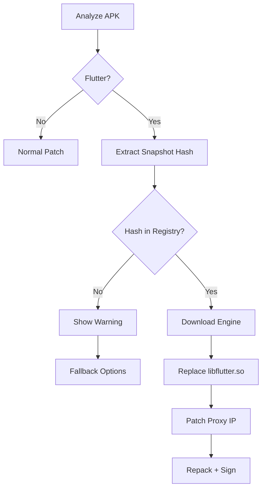

Engine source: github.com/<org>/pincatcher-reflutter

Hosting:

· Primary: GitHub Releases
· Mirror: Cloudflare R2 (opsional)

Auto-build:

· GitHub Actions trigger saat Flutter stable rilis
· Manual trigger untuk versi tertentu
· Output: libflutter_<hash>_<arch>.so + checksum

Tasks:

☐ Extract snapshot hash dari libapp.so
☐ Lookup di enginehash.csv
☐ Download engine (per arch: arm64, armv7)
☐ Verify SHA-256 checksum
☐ Replace libflutter.so di APK
☐ Patch proxy IP di libapp.so (reFlutter approach)
☐ Verify hash match
☐ Fallback: warning + manual download link

Fork maintenance:

· Review upstream setiap 2 minggu
· Auto-build saat Flutter stable rilis
· Community PR untuk engine versi baru
· Dokumentasi build di CONTRIBUTING.md

Sub-Feature 3.5: APK Repack & Sign

Idea:
Rebuild APK dan sign dengan keystore baru. Keystore unik per APK agar tidak konflik.

Flow:

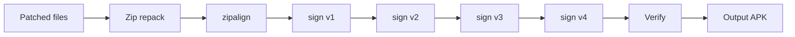

Zipalign: Bundle binary di jniLibs/ (arm64 + armv7, ~270 KB).

Tasks:

☐ Zip repack streaming
☐ zipalign -P 16 -f 4 via bundled binary
☐ Generate keystore (RSA 2048, self-signed)
☐ Sign v1 + v2 + v3 + v4
☐ Verify signature
☐ Output + keystore info

Keystore naming: <package>-<timestamp>.jks

---

Feature 4: APK Installer

Idea:
Install APK hasil patch. Karena signature beda, install akan konflik — user harus uninstall original dulu.

Tasks:

☐ Cek existing package
☐ Prompt uninstall (warning data loss)
☐ Install via PackageInstaller API
☐ Track patched APKs
☐ UI list patched apps

Sub-Feature 4.1: Signature Conflict Handler

Idea:
Deteksi konflik signature. Opsi: uninstall original atau abort.

Tasks:

☐ Cek existing via PackageManager
☐ Compare signature
☐ Dialog konflik
☐ Backup data (opsional via ADB)
☐ Handle INSTALL_FAILED_UPDATE_INCOMPATIBLE

Sub-Feature 4.2: Patched APK Registry

Idea:
Catatan APK yang sudah di-patch.

Tasks:

☐ Room table patched_apks
☐ UI list patched apps
☐ Actions: re-patch, uninstall + restore, update

---

Feature 5: Certificate Manager

Idea:
Generate CA cert, install sebagai user cert. Wizard untuk non-root.

Tasks:

☐ Generate root CA (BouncyCastle)
☐ Leaf cert per host (cache)
☐ Export .crt
☐ Wizard install user cert
☐ Verify install

Sub-Feature 5.1: Root CA Generator

Idea:
Generate root CA sekali. Private key di Android Keystore.

Spec:

· Algorithm: EC P-256 (modern) atau RSA 2048
· Validity: 10 tahun
· Subject: CN=PinCatcher CA, O=PinCatcher
· Key usage: keyCertSign, cRLSign

Tasks:

☐ Generate keypair
☐ Simpan private key di Keystore
☐ Self-signed cert
☐ Export public cert

Sub-Feature 5.2: Dynamic Leaf Cert

Idea:
Generate cert per hostname saat MITM. Cache LRU.

Tasks:

☐ Cert cache (memory + disk)
☐ SAN handling (wildcard, multi-domain)
☐ SNI parsing
☐ Sign dengan root CA
☐ Cache: <hostname>.pem

Sub-Feature 5.3: User Cert Install Wizard

Idea:
Pandu user install user cert via Settings.

Flow:

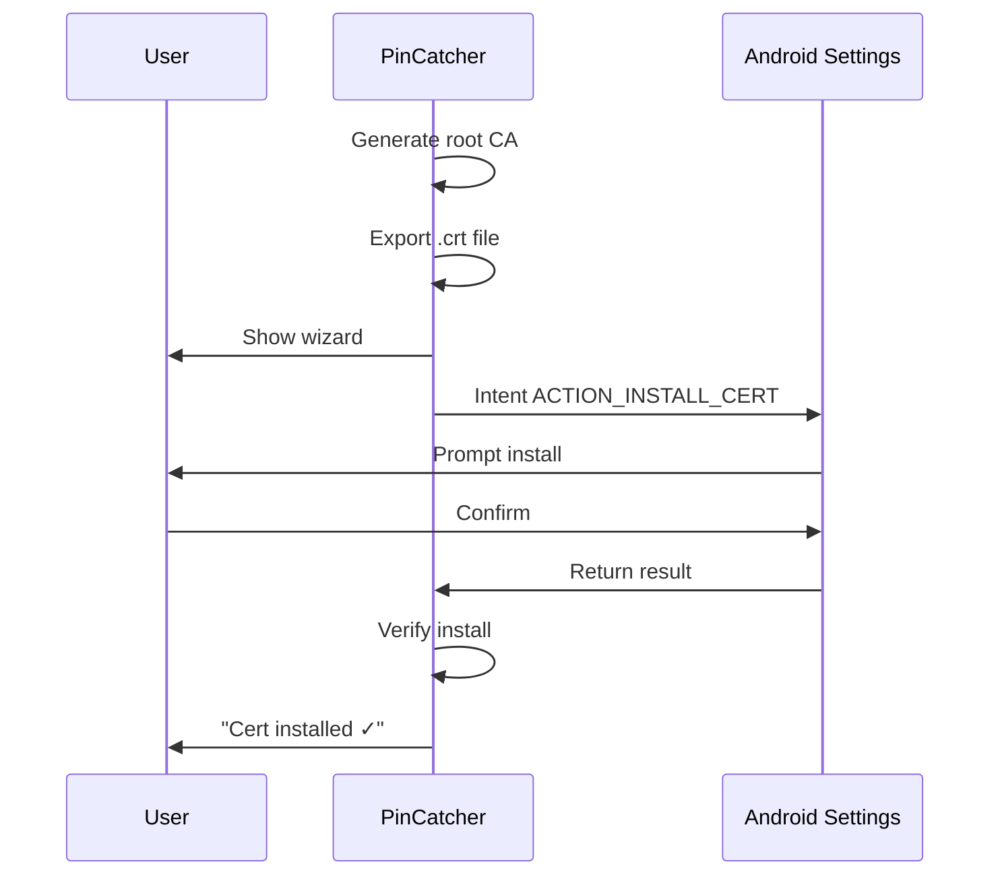

Tasks:

☐ Generate cert file
☐ KeyChain.createInstallIntent()
☐ Fallback: android.settings.SECURITY_SETTINGS
☐ Verify install (KeyChain query)
☐ Manual instructions + screenshot per OEM

---

Feature 6: Traffic Capture Engine

Idea:
Non-root capture via VpnService. Proxy lokal MITM dengan user CA cert.

Tasks:

☐ Proxy server (Ktor CIO)
☐ TLS MITM
☐ HTTP parser
☐ WebSocket
☐ Streaming body
☐ Per-app filter
☐ Loop guard

Sub-Feature 6.1: Proxy Server

Idea:
Local proxy server untuk HTTP/HTTPS.

Fitur:

· HTTP/1.1
· HTTPS via CONNECT + MITM
· WebSocket upgrade
· Chunked transfer
· gzip/deflate/br decompression
· Keep-alive
· Streaming body

Tasks:

☐ Ktor CIO server
☐ HTTP parser
☐ CONNECT handling
☐ TLS MITM:
  ☐ Extract SNI
  ☐ Generate leaf cert
  ☐ Handshake client + server
  ☐ Relay data
☐ WebSocket handling
☐ Streaming → Storage
☐ Backpressure

Sub-Feature 6.2: VPN Mode (Primary)

Idea:
Route traffic via tun ke proxy lokal. Non-root friendly.

Tasks:

☐ VpnService setup
☐ Builder: address, route, DNS
☐ tun → proxy redirect
☐ Packet parser (TCP minimal)
☐ DNS handling
☐ Foreground service + notif
☐ Handle VPN permission deny

Sub-Feature 6.3: Per-App Filter

Idea:
addAllowedApplication(package) — hanya capture app target.

Tasks:

☐ Package picker UI
☐ Apply addAllowedApplication / addDisallowedApplication
☐ Preview: "hanya capture app X"

Sub-Feature 6.4: Loop Guard ⭐

Idea:
Saat VPN aktif, semua traffic lewat tun — termasuk traffic PinCatcher sendiri. Ini bisa bikin loop tak terbatas.

Solusi 3 lapis:

Layer 1: VpnService Disallow Self

```kotlin
builder.addDisallowedApplication(context.packageName)
```

Layer 2: Proxy-Level UID Filter

```kotlin
val clientUid = getUidFromSocket(socket)
if (clientUid == android.os.Process.myUid()) {
    socket.close()
    return
}
```

Layer 3: Heartbeat Detection

```kotlin
if (detectLoopPattern(flows)) {
    stopCapture()
    notifyUser("Loop detected. VPN stopped.")
}
```

Tasks:

☐ Layer 1: addDisallowedApplication(self)
☐ Layer 2: proxy UID filter
☐ Layer 3: loop detection + auto-stop
☐ Test: buka PinCatcher saat VPN aktif, assert 0 flow
☐ Dokumentasikan di FAQ

---

Feature 7: Traffic Inspector UI

Idea:
UI untuk melihat, memfilter, menganalisis flow. Ringan dengan Compose + paging.

Tasks:

☐ List view dengan paging
☐ Detail view (tab)
☐ Body viewer
☐ Search bar
☐ Filter chips
☐ Dark mode

Sub-Feature 7.1: Flow List

Item layout:

```
┌─────────────────────────────────────────┐
│ 🟢 GET   api.example.com   200   1.2 KB │
│    /v1/user/profile         124ms       │
├─────────────────────────────────────────┤
│ 🔴 POST  api.example.com   401   340 B  │
│    /v1/login                89ms        │
└─────────────────────────────────────────┘
```

Tasks:

☐ LazyColumn + Paging3
☐ Color coding status
☐ App icon + package
☐ Swipe action (delete, replay)
☐ Real-time append via Flow
☐ Scroll to top button
☐ Auto-scroll toggle

Sub-Feature 7.2: Flow Detail

Tabs:

· Overview
· Request Headers
· Request Body
· Response Headers
· Response Body
· Timing

Tasks:

☐ Tab navigation
☐ Body viewer: JSON, XML, HTML, image, hex, raw
☐ Auto-detect content type
☐ Copy as cURL
☐ Share flow
☐ Save body ke file
☐ Timing waterfall

Sub-Feature 7.3: Search & Filter

Search:

· URL (FTS)
· Header key/value
· Body text (FTS, opt-in)
· Status code
· Method
· Host

Filter:

· Method, status, content-type, host, app

Tasks:

☐ SQLite FTS5
☐ Filter builder UI
☐ Saved filters
☐ Regex mode
☐ Combine search + filter

---

Feature 8: Request Manipulation

Idea:
Replay, breakpoint, rewrite.

Tasks:

☐ Replay engine
☐ Breakpoint manager
☐ Rewrite rules
☐ Mock response

Sub-Feature 8.1: Replay

Tasks:

☐ Replay as-is
☐ Edit & replay
☐ Batch replay
☐ Diff hasil
☐ Save replay history

Sub-Feature 8.2: Breakpoint

Tasks:

☐ Rule-based breakpoint
☐ Editor UI (headers + body)
☐ Forward / drop / modify
☐ Timeout handling (30s)
☐ Notification saat hit

Sub-Feature 8.3: Rewrite Rules

Rule format:

```json
{
  "name": "Inject auth header",
  "enabled": true,
  "matcher": {
    "url_regex": ".*api\\.example\\.com.*",
    "method": ["GET", "POST"]
  },
  "action": {
    "type": "add_request_header",
    "key": "X-Debug",
    "value": "1"
  }
}
```

Action types: add/remove header, replace body, redirect, mock, delay.

Tasks:

☐ Rule DSL (JSON)
☐ Regex support
☐ Import/export
☐ Priority ordering
☐ UI editor

Sub-Feature 8.4: Mock Response

Tasks:

☐ Mock rule
☐ Static response (file)
☐ Dynamic response (template)
☐ Toggle on/off

---

Feature 9: Export & Import

Idea:
HAR, cURL, session file.

Tasks:

☐ HAR 1.2 export
☐ cURL export
☐ Session save/load

Sub-Feature 9.1: HAR Export

Tasks:

☐ Schema HAR 1.2 lengkap
☐ Streaming writer
☐ Include/exclude body
☐ Compression (gzip)
☐ Share via intent

Sub-Feature 9.2: cURL Export

Tasks:

☐ Generate cURL command
☐ Include headers + body
☐ Copy to clipboard
☐ Batch export

Sub-Feature 9.3: Session Save

Format:

```
session.pincatcher (ZIP)
  ├─ manifest.json
  ├─ pincatcher.db
  └─ blobs/
```

Tasks:

☐ Container format
☐ Export / import
☐ Merge session

---

Feature 10: Storage Manager ⭐

Idea:
Key differentiator. Strategi berlapis:

1. Body deduplication (SHA-256)
2. Compression (gzip text, skip image)
3. Size threshold
4. Ring buffer
5. Metadata-only mode
6. Auto-purge
7. Streaming to disk

Tasks:

☐ Body hash + dedup
☐ Compression pipeline
☐ Ring buffer policy
☐ Threshold config
☐ Auto-purge daemon
☐ Storage dashboard
☐ Vacuum SQLite

Sub-Feature 10.1: Body Deduplication

Idea:
Body identik disimpan sekali. Saving estimate: 30–60% untuk sesi panjang.

Tasks:

☐ Hash SHA-256 saat write
☐ Cek existing
☐ Refcount + GC
☐ Tabel bodies terpisah
☐ File sharded (ab/, cd/)

Sub-Feature 10.2: Compression Pipeline

Idea:
Text > 1 KB → gzip. Image/video → as-is.

Tasks:

☐ Detect content-type
☐ Gzip text body
☐ Skip compressed
☐ Track size_raw vs size_stored

Sub-Feature 10.3: Ring Buffer Policy

Default:

· Max flows: 5000
· Max storage: 50 MB
· Max age: 24 jam

Tasks:

☐ Policy engine
☐ Background purge (WorkManager)
☐ UI konfigurasi
☐ Notifikasi saat purge

Sub-Feature 10.4: Metadata-Only Mode

Tasks:

☐ Toggle global
☐ Per-host rule
☐ On-demand body fetch
☐ Indicator di UI

Sub-Feature 10.5: Storage Dashboard

Layout:

```
┌────────────────────────────────────────┐
│  Storage Usage                         │
├────────────────────────────────────────┤
│  Total: 32 MB / 50 MB     ██████░░ 64% │
│  Flows: 1,234 / 5,000     ████░░░░ 25% │
│  Dedup saving: 18 MB (36%)             │
│  Compression saving: 4 MB (8%)         │
├────────────────────────────────────────┤
│  By Host:                              │
│  • api.example.com    12 MB            │
│  • cdn.example.com    8 MB             │
├────────────────────────────────────────┤
│  [Clear All]  [Export]                 │
└────────────────────────────────────────┘
```

Tasks:

☐ Query storage usage
☐ Breakdown per host/app
☐ Dedup/compression saving
☐ Clear all

---

Feature 11: Auto-Update

Idea:
Update via GitHub Releases. User bisa update tanpa Play Store.

Flow:

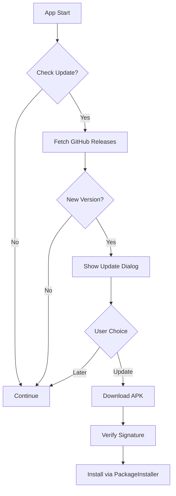

Tasks:

☐ GitHub Releases API client
☐ Version check (semver)
☐ Download APK
☐ Verify signature
☐ Install via PackageInstaller
☐ Changelog viewer
☐ Optional: Obtainium support

---

4. User Flow

4.1 First-Time Setup

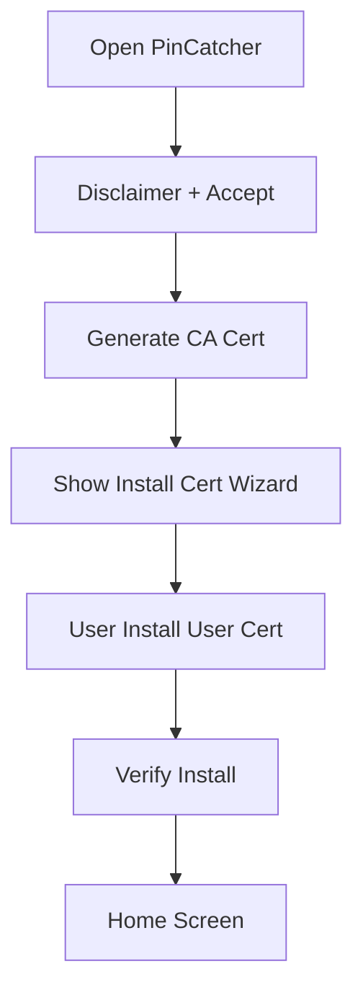

4.2 Extract → Analyze → Patch → Install

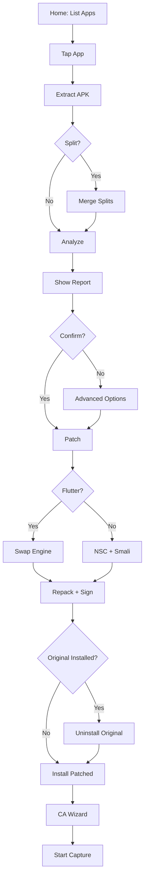

4.3 Capture → Inspect → Export

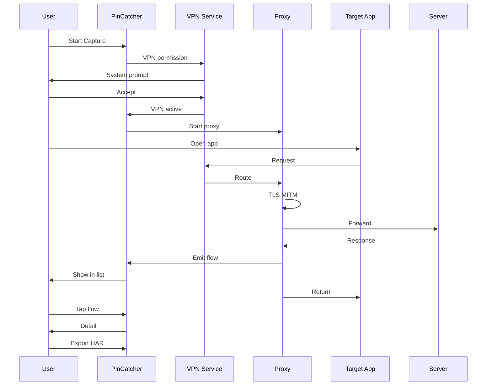

4.4 Flutter Patch

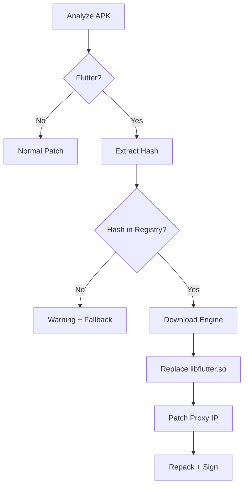

4.5 Stop & Cleanup

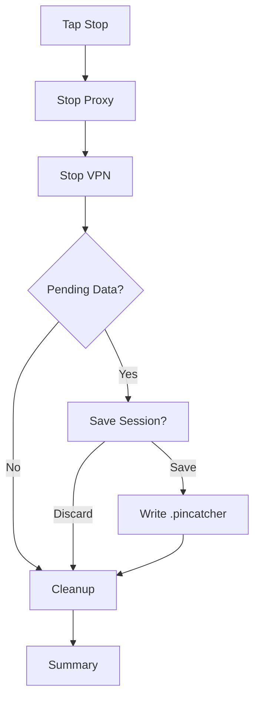

---

5. Architecture

5.1 High-Level

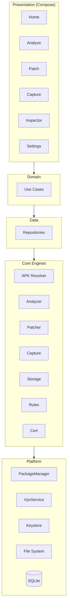

5.2 Patch Engine

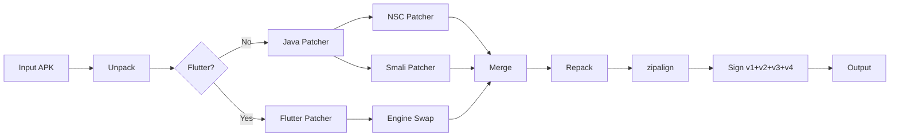

5.3 Capture Engine

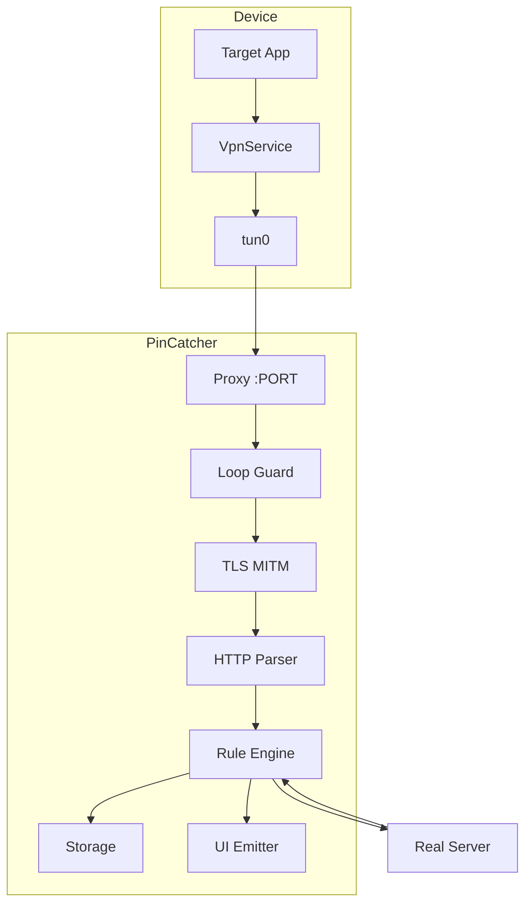

5.4 Storage Engine

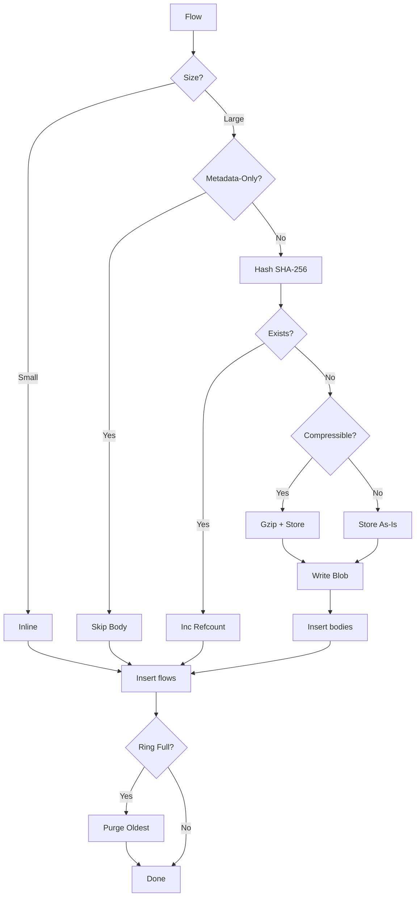

5.5 Certificate Chain

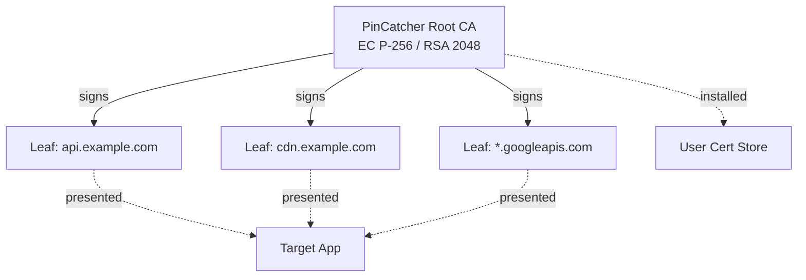

5.6 Component Interaction

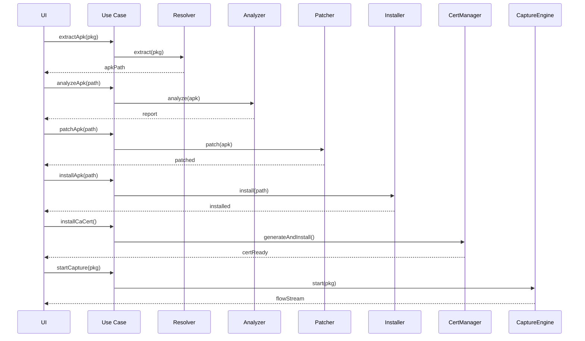

5.7 Security

· CA private key di Android Keystore (StrongBox jika tersedia)
· Proxy listen 127.0.0.1 (kecuali manual mode)
· Semua patching lokal — no upload
· Temp files cleanup otomatis
· Disclaimer wajib accept

---

6. Database Schema

6.1 ER Diagram

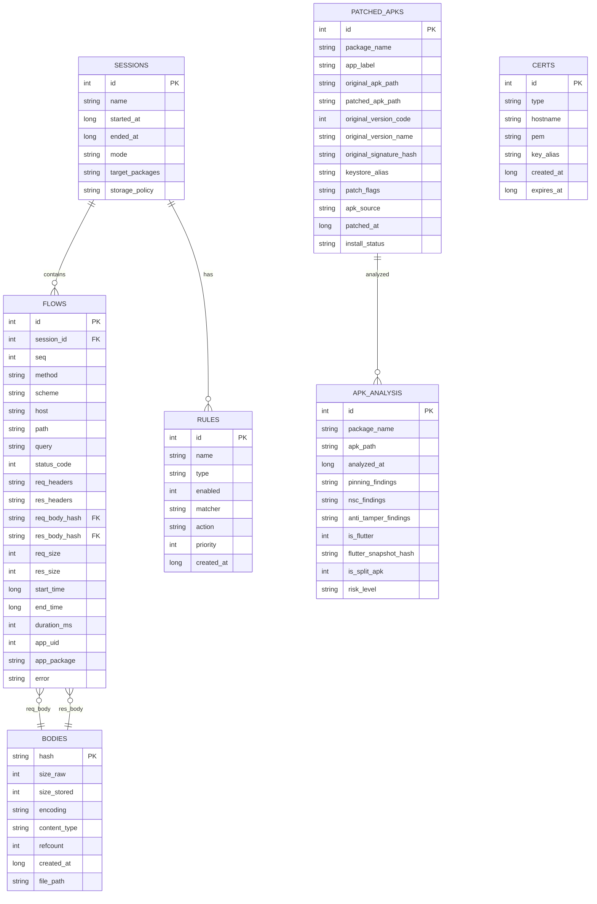

6.2 SQL Schema (Room)

```sql
-- SESSIONS
CREATE TABLE sessions (
    id INTEGER PRIMARY KEY AUTOINCREMENT,
    name TEXT NOT NULL,
    started_at INTEGER NOT NULL,
    ended_at INTEGER,
    mode TEXT NOT NULL,
    target_packages TEXT,
    storage_policy TEXT
);
CREATE INDEX idx_sessions_started ON sessions(started_at DESC);

-- FLOWS
CREATE TABLE flows (
    id INTEGER PRIMARY KEY AUTOINCREMENT,
    session_id INTEGER NOT NULL,
    seq INTEGER NOT NULL,
    method TEXT NOT NULL,
    scheme TEXT NOT NULL,
    host TEXT NOT NULL,
    path TEXT NOT NULL,
    query TEXT,
    status_code INTEGER,
    req_headers TEXT,
    res_headers TEXT,
    req_body_hash TEXT,
    res_body_hash TEXT,
    req_size INTEGER,
    res_size INTEGER,
    start_time INTEGER NOT NULL,
    end_time INTEGER,
    duration_ms INTEGER,
    app_uid INTEGER,
    app_package TEXT,
    error TEXT,
    FOREIGN KEY (session_id) REFERENCES sessions(id) ON DELETE CASCADE,
    FOREIGN KEY (req_body_hash) REFERENCES bodies(hash),
    FOREIGN KEY (res_body_hash) REFERENCES bodies(hash)
);
CREATE INDEX idx_flows_session ON flows(session_id);
CREATE INDEX idx_flows_host ON flows(host);
CREATE INDEX idx_flows_status ON flows(status_code);
CREATE INDEX idx_flows_time ON flows(start_time DESC);
CREATE INDEX idx_flows_method ON flows(method);
CREATE INDEX idx_flows_app ON flows(app_package);

-- BODIES
CREATE TABLE bodies (
    hash TEXT PRIMARY KEY,
    size_raw INTEGER NOT NULL,
    size_stored INTEGER NOT NULL,
    encoding TEXT,
    content_type TEXT,
    refcount INTEGER DEFAULT 0,
    created_at INTEGER NOT NULL,
    file_path TEXT
);
CREATE INDEX idx_bodies_refcount ON bodies(refcount);
CREATE INDEX idx_bodies_created ON bodies(created_at);

-- RULES
CREATE TABLE rules (
    id INTEGER PRIMARY KEY AUTOINCREMENT,
    name TEXT NOT NULL,
    type TEXT NOT NULL,
    enabled INTEGER DEFAULT 1,
    matcher TEXT NOT NULL,
    action TEXT NOT NULL,
    priority INTEGER DEFAULT 100,
    created_at INTEGER
);
CREATE INDEX idx_rules_enabled ON rules(enabled);
CREATE INDEX idx_rules_priority ON rules(priority DESC);

-- CERTS
CREATE TABLE certs (
    id INTEGER PRIMARY KEY AUTOINCREMENT,
    type TEXT NOT NULL,
    hostname TEXT,
    pem TEXT NOT NULL,
    key_alias TEXT,
    created_at INTEGER,
    expires_at INTEGER
);
CREATE INDEX idx_certs_host ON certs(hostname);
CREATE INDEX idx_certs_type ON certs(type);

-- PATCHED_APKS
CREATE TABLE patched_apks (
    id INTEGER PRIMARY KEY AUTOINCREMENT,
    package_name TEXT NOT NULL,
    app_label TEXT,
    original_apk_path TEXT,
    original_version_code INTEGER,
    original_version_name TEXT,
    original_signature_hash TEXT,
    patched_apk_path TEXT,
    patched_version_code INTEGER,
    keystore_alias TEXT NOT NULL,
    patch_flags TEXT,
    apk_source TEXT,
    source_verified INTEGER DEFAULT 0,
    patched_at INTEGER NOT NULL,
    install_status TEXT,
    notes TEXT
);
CREATE INDEX idx_patched_pkg ON patched_apks(package_name);
CREATE INDEX idx_patched_time ON patched_apks(patched_at DESC);

-- APK_ANALYSIS
CREATE TABLE apk_analysis (
    id INTEGER PRIMARY KEY AUTOINCREMENT,
    package_name TEXT,
    apk_path TEXT,
    analyzed_at INTEGER,
    pinning_findings TEXT,
    nsc_findings TEXT,
    anti_tamper_findings TEXT,
    is_flutter INTEGER DEFAULT 0,
    flutter_snapshot_hash TEXT,
    flutter_engine_supported INTEGER DEFAULT 0,
    is_split_apk INTEGER DEFAULT 0,
    split_count INTEGER DEFAULT 0,
    merged_apk_path TEXT,
    risk_level TEXT
);
CREATE INDEX idx_analysis_pkg ON apk_analysis(package_name);

-- FTS
CREATE VIRTUAL TABLE flows_fts USING fts5(
    url, req_headers, res_headers,
    content='flows', content_rowid='id',
    tokenize='unicode61'
);

CREATE TRIGGER flows_ai AFTER INSERT ON flows BEGIN
    INSERT INTO flows_fts(rowid, url, req_headers, res_headers)
    VALUES (new.id, new.scheme || '://' || new.host || new.path, new.req_headers, new.res_headers);
END;

CREATE TRIGGER flows_ad AFTER DELETE ON flows BEGIN
    DELETE FROM flows_fts WHERE rowid = old.id;
END;
```

6.3 File Storage Layout

```
/data/data/com.pincatcher/
├── databases/
│   └── pincatcher.db
├── blobs/                    # Dedup body storage
│   ├── ab/
│   │   └── abcdef...bin
│   └── ...
├── certs/
│   ├── root.pem
│   └── leaves/
│       ├── api.example.com.pem
│       └── ...
├── keystores/
│   └── com.example.app-1700000000.jks
├── apks/
│   ├── original/
│   │   └── com.example.app/
│   └── patched/
│       └── com.example.app/
├── sessions/
│   └── 1700000000.pincatcher
├── flutter_engines/
│   └── <hash>-arm64.so
└── tmp/                      # Auto-cleanup
```

6.4 Example Queries

Flow dengan body:

```sql
SELECT 
    f.id, f.method, f.host, f.path, f.status_code,
    f.duration_ms, f.res_size,
    b.file_path AS res_body_path,
    b.encoding AS res_body_encoding
FROM flows f
LEFT JOIN bodies b ON f.res_body_hash = b.hash
WHERE f.session_id = ? AND f.host LIKE ?
ORDER BY f.start_time DESC
LIMIT 100 OFFSET ?;
```

FTS:

```sql
SELECT f.* 
FROM flows f
JOIN flows_fts fts ON f.id = fts.rowid
WHERE flows_fts MATCH ?
ORDER BY f.start_time DESC
LIMIT 100;
```

GC bodies:

```sql
DELETE FROM bodies 
WHERE refcount = 0 AND created_at < ?;
```

Storage usage:

```sql
SELECT 
    SUM(size_stored) AS total_bytes,
    COUNT(*) AS body_count,
    SUM(size_raw - size_stored) AS saved_bytes
FROM bodies;
```

---

7. Tech Stack

7.1 Core

Layer Pilihan Alasan
Bahasa Kotlin 1.9+ Native Android, coroutines
UI Jetpack Compose Modern, deklaratif
Async Coroutines + Flow Backpressure, streaming
DI Koin Ringan, no codegen
Build Gradle KTS + Version Catalog Standar modern
Min SDK 26 (Android 8.0) VpnService stabil
Target SDK 34 (Android 14) Play Store requirement
Primary test Android 13 (API 33) Target user

7.2 APK Analysis & Patching

Komponen Pilihan Size
Zip reader java.util.zip + Zip4j ~200 KB
AXML decode apk-parser / custom ~150 KB
DEX scan dexlib2 (smali) ~2 MB
Smali smali + baksmali ~2 MB
APK sign apksig (Google) ~300 KB
Zipalign Bundled binary ~270 KB
CA cert BouncyCastle ~2 MB
Flutter engine pincatcher-reflutter (on-demand)

7.3 Capture Engine

Komponen Pilihan Size
HTTP server Ktor CIO ~2 MB
TLS MITM Conscrypt + BouncyCastle (shared)
VPN Android VpnService 0

7.4 Storage

Komponen Pilihan
Metadata DB Room (SQLite)
Body blob File system (sharded)
Compression java.util.zip gzip
Encryption (v2) SQLCipher

7.5 Utilities

Komponen Pilihan
JSON kotlinx.serialization
Image Coil
Logging Timber
Crash (opt-in) Sentry
Test JUnit5 + Turbine + MockK

7.6 i18n

Bahasa Kode
Indonesian in
English en (default)
Russian ru

7.7 Open Source

Aspek Detail
Lisensi Apache-2.0
Repo github.com/<org>/pincatcher
Fork reFlutter github.com/<org>/pincatcher-reflutter
CI/CD GitHub Actions
Distribution GitHub Releases + F-Droid
Auto-update In-app updater + Obtainium
Docs README + Wiki
Community GitHub Discussions + Telegram

7.8 Development Workflow

Mobile-first development:

· Semua coding dilakukan di HP
· Git operations via Termux / MGit
· Build via GitHub Actions (tidak build lokal)
· Test via CI + manual di device

Repository structure:

```
pincatcher/
├── app/                    # Android app
├── core/                   # Core modules
├── feature/                # Feature modules
├── build-logic/            # Gradle convention
├── .github/
│   └── workflows/
│       ├── build.yml       # Build APK
│       ├── release.yml     # Release to GitHub
│       └── test.yml        # Run tests
├── docs/                   # Documentation
├── CONTRIBUTING.md
├── LICENSE
└── README.md
```

CI/CD Pipeline:

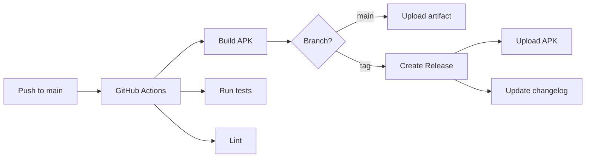

7.9 Build & Distribution

Tool Pilihan
CI/CD GitHub Actions
Testing JUnit5, Espresso, Turbine
Lint Detekt, Android Lint
Release GitHub Releases
Signing Keystore di GitHub Secrets
Versioning SemVer
Changelog auto-generated

7.10 Dependencies Map

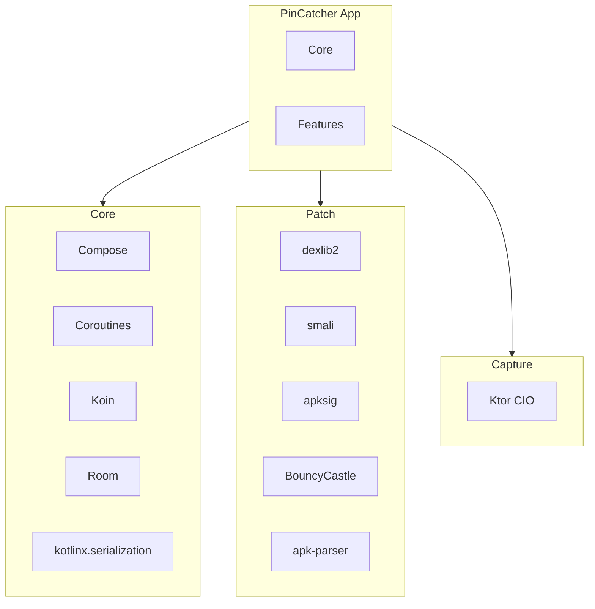

---

8. Appendix

8.1 Glossary

Term Definisi
APK Android Package Kit
Split APK APK dipecah jadi base + config
AAB Android App Bundle
NSC Network Security Config
SSL Pinning Verify server cert match expected
MITM Man-In-The-Middle
CA Certificate Authority
HAR HTTP Archive
DEX Dalvik Executable
Smali Assembly-like DEX representation
AXML Android Binary XML
ABI Application Binary Interface
UID User ID per app
VpnService Android VPN API
tun Network tunnel interface
SNI Server Name Indication
reFlutter Patched Flutter engine

8.2 Roadmap

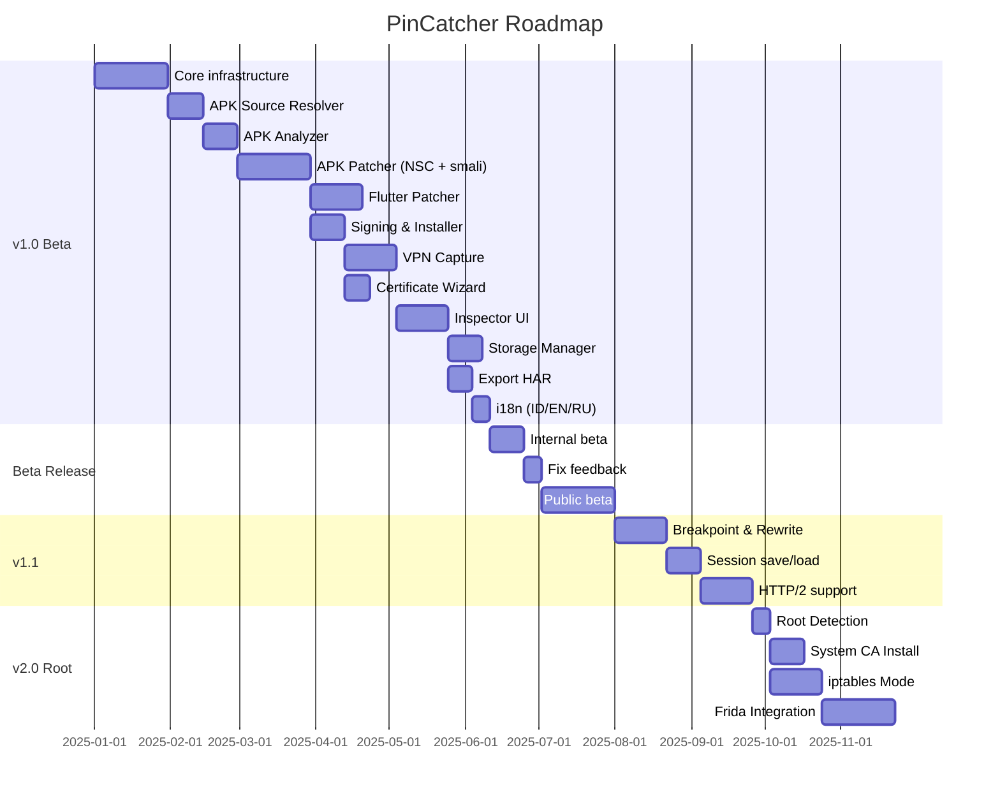

8.3 Testing Plan

Device matrix:

Device Android Tester
Pixel 6a 13 Internal
Samsung A54 13 Internal
Xiaomi Redmi Note 12 13 Internal
Oppo Reno 8 13 Community
Vivo V27 13 Community
Pixel 8 14 Community
Emulator AVD 13, 14, 15 CI

APK test matrix (target 50 APK):

Kategori Contoh
Native OkHttp Tokopedia, Gojek, Shopee
Native custom TM Banking apps (with permission)
Flutter Beberapa app Flutter lokal
Split APK WhatsApp, Instagram
Anti-tamper Beberapa game
WebView heavy Browser apps

8.4 Contributing

Untuk kontributor:

1. Fork repo
2. Buat branch fitur
3. Commit dengan pesan jelas
4. Push ke fork
5. Buat Pull Request
6. Tunggu review

Kode style:

· Kotlin official style guide
· Detekt untuk lint
· Semua PR harus pass CI

8.5 FAQ

Q: Apakah PinCatcher butuh root?
A: Tidak. v1.0 fokus 100% non-root.

Q: Apakah bisa capture app banking?
A: Hanya jika Anda punya izin. Beberapa app banking punya anti-tamper kuat yang tidak bisa di-bypass non-root.

Q: Apakah data saya dikirim ke server?
A: Tidak. Semua proses lokal.

Q: Bagaimana cara update?
A: Via GitHub Releases. Bisa manual atau pakai Obtainium.

Q: Apakah support Flutter?
A: Ya, tapi tergantung snapshot hash. Cek di app untuk status.

Q: Apakah bisa patch APK dari Play Store?
A: Ya, selama APK-nya bisa di-extract dari device.

8.6 Referensi

· reFlutter — https://github.com/Impact-I/reFlutter
· APKEditor — https://github.com/REAndroid/APKEditor
· apksig — https://github.com/google/apksig
· smali/baksmali — https://github.com/JesusFreke/smali
· Ktor — https://ktor.io/
· BouncyCastle — https://www.bouncycastle.org/
· Conscrypt — https://github.com/google/conscrypt
· HAR spec — http://www.softwareishard.com/blog/har-12-spec/

---

End of Document

Dokumen ini adalah living document. Setiap perubahan signifikan akan dicatat di changelog. Untuk pertanyaan atau klarifikasi, buka GitHub Discussion.

Changelog:

· v1.0 (initial): Full PRD — non-root, Flutter support, storage optimization, open source, GitHub distribution.
· v1.0 (revised): Clean version, no blockers, all decisions finalized.